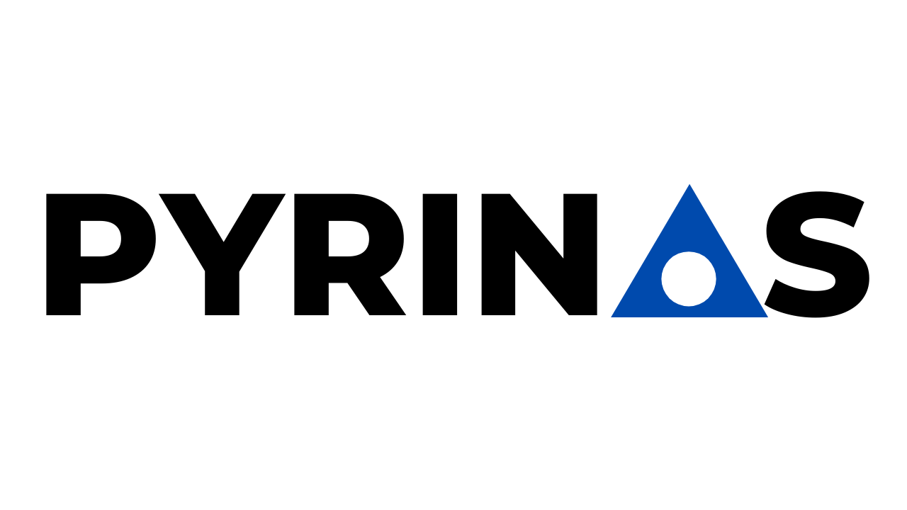

# Pyrinas Zephyr



Open companion cloud client to Pyrinas Server for the [nRF9160 Feather](https://www.jaredwolff.com/store/nrf9160-feather/) and 
Zephyr + Nordic Connect SDK (NCS).

## Setting up

If you haven't already, [set up your SDK](https://docs.jaredwolff.com/nrf9160-sdk-setup-mac.html#installing-sdk). NCS 1.5.x works best.

Once you have NCS installed add Pyrinas to your `west.yml` file within the `nrf` directory. In the `remotes` section add:

```yaml
  remotes:
    - name: pyrinas
      url-base: https://github.com/pyrinas-iot
```

In the projects section add:

```yaml
  projects:
    - name: pyrinas
      repo-path: pyrinas-zephyr
      revision: v1.5.x
      path: pyrinas
      remote: pyrinas
      import: true
```

Then running `west update` will fetch the latest version of Pyrinas to your NCS directory. Make sure you change `revision` to match which NCS revision you're using.

## Building the Pyrinas sample

The corresponding Pyrinas client example is located in `applications/sample`. You can build it by setting the environment and then running:

```
> cd /opt/nordic/ncs/v1.5.0 ; export PATH=/opt/nordic/ncs/v1.5.0/toolchain/bin:/usr/bin:/bin:/usr/sbin:/sbin:/usr/local/bin ; export GIT_EXEC_PATH=/opt/nordic/ncs/v1.5.0/toolchain/Cellar/git/2.26.2/libexec/git-core ; export ZEPHYR_TOOLCHAIN_VARIANT=gnuarmemb ; export GNUARMEMB_TOOLCHAIN_PATH=/opt/nordic/ncs/v1.5.0/toolchain ; clear
> cd pyrinas/applications/sample/
> west build -b circuitdojo_feather_nrf9160ns
```

[Flash as normal](https://docs.jaredwolff.com/nrf9160-programming-and-debugging.html) either by using `newtmgr` or flashing via `nrfjprog`.

## Provision your certificates:

You can follow the instructions [here](https://www.jaredwolff.com/how-to-connect-nrf9160-feather-to-mosquitto/#add-certs-to-device) for now.

## Don't see what you're looking for?

Consider creating a feature request and supporting this project by [purchasing hardware](https://www.jaredwolff.com/store/nrf9160-feather/).


